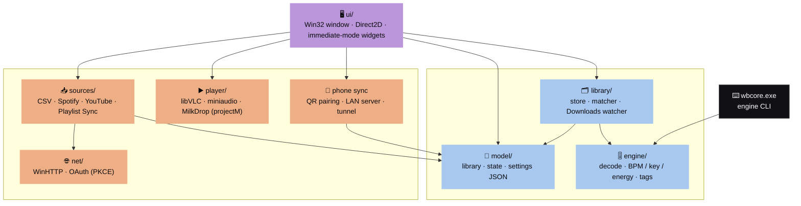

<div align="center">

# 🎛️ WreckBox for Windows

### The DJ library manager — rebuilt as one small native C++ app for weak Windows PCs

*Turns your Spotify & YouTube playlists into one library, analyses every track (BPM · key · energy), tags it and files it so Rekordbox and other DJ software read the right data.*

<br>

[](#-download--install)
[](#-tech-stack)
[](#-architecture)
[](#-features)

[**⬇️ Download**](#-download--install) · [**✨ Features**](#-features) · [**🏗️ Architecture**](#-architecture) · [**🔨 Build**](#-build-it-yourself) · [**📖 Docs**](#-documentation)

</div>

---

A native Windows rewrite of [WreckBox](https://github.com/moloyb301-eng/wreckbox). The Flutter + Rust + embedded-Python
desktop build works, but it is heavy on old machines. This version is **one small C++ executable** built for weak
Windows 10/11 PCs — old dual-core, ~4 GB RAM, integrated or no GPU.

It is a **drop-in replacement**: it reads and writes the same `Music\WreckBox` folder and settings file, and speaks the
same phone-sync protocol, so the existing Android app and existing libraries keep working. Switch between the Flutter
build and this one freely.

### 📊 How it compares

| | Flutter build (v0.2.0) | **This build** (native C++) |
|---|---|---|
| 📦 **Download** | 38 MB zip *(Flutter, Rust DLL, embedded Python)* | **71 MB** zip *(VLC engine + 9,795 MilkDrop presets + Soulseek sidecar; ~53 MB without the sidecar, 19 MB without presets)* |
| 🧠 **RAM** browsing 5,000 tracks | not measured | **38 MB** at rest → 69 MB after heavy scroll *(target < 60 MB)* |
| ⚡ **Cold start** | not measured | **~0.12 s** to first paint *(target < 0.3 s)* |
| 💤 **Idle CPU** | Flutter frame scheduler | **0 %** — draws only on change |
| ▶️ **Playing** | media_kit (libmpv) | **1.4 %** of one core *(player bar)* → ~42 % *(full-screen MilkDrop @ 720p/60fps)*; Winamp bars 3.3 % |

<br>

## ⬇️ Download & install

<div align="center">

[](downloads/WreckBox-0.1.0-win-native-x64.zip?raw=1)

</div>

The latest build of this branch — includes the file-type column and the "My folders" list.

1. **Unzip** into a folder of its own (e.g. `C:\WreckBox`). The app needs the files next to it, so don't move
   `wreckbox.exe` out on its own.
2. **Run `wreckbox.exe`.** Windows SmartScreen may warn that the app is unrecognised (it isn't signed) — choose
   *More info → Run anyway*.

> Windows 10 or 11, 64-bit. Uses the same `Music\WreckBox` library as the original app.

<br>

## ✨ Features

| | Feature | What it does |
|---|---|---|
| 🎚️ | **Analysis engine** | Decode → BPM, key, energy, tags — identical results to the original Rust engine, same speed or faster |
| 🗂️ | **Library store** | Same JSON files as the Flutter build. Loads 5,000 tracks in ~189 ms, searches in 0.8 ms |
| 📥 | **Imports** | CSV (Exportify / TuneMyMusic / Takeout) with MusicBrainz + Deezer lookups, plus direct Spotify & YouTube |
| 🔄 | **Playlist Sync** | A *Sync* button on every playlist mirrors it from its source (Spotify, YouTube or CSV) |
| ▶️ | **Player** | libVLC engine — 18+ formats, internet radio, files outside the library, 10-band EQ, volume normalizer, media keys |
| 🌈 | **MilkDrop visualizer** | Full-screen projectM presets (9,795 of them) with a glass player panel — swirls, seek, EQ, "Up next" |
| 🥁 | **Beat sync** | Fed exactly what you hear, every frame — kicks pulse the picture, presets cut on drops, `[` / `]` nudge ±25 ms |
| 📊 | **Winamp bars** | Classic spectrum / oscilloscope fallback — and the automatic choice on a PC without OpenGL 3.3 |
| 📱 | **Phone sync** | QR pairing + LAN server, WreckBox account, "Use from anywhere" tunnel (via Cloudflare `cloudflared`) |
| 🔍 | **Soulseek** | Sync through the bundled sidecar, plus a built-in native client (beta, opt-in) |
| 📁 | **My folders** | The songs already on your PC in folders you pick — same search, filters, sort, playback and inspector |
| 🩹 | **Housekeeping** | Update check, bug reports, Downloads organiser, onboarding |

<br>

## 🚦 Phase status

Work happens in phases — see [docs/PLAN.md](docs/PLAN.md) for the full list with checkboxes.

| Phase | What | State |
|:---:|---|---|
| 0 | Project skeleton, build, tests | ✅ done |
| 1 | Engine: decode, BPM/key/energy, tags, `wbcore.exe` | ✅ identical results to the Rust engine; same speed or faster except M4A |
| 2 | Data model + library store (same JSON files) | ✅ tested — load 5,000 in 189 ms, search 0.8 ms *(awaiting a real-library round trip)* |
| 3 | Win32 + Direct2D UI: sidebar, Home, track lists, inspector | ✅ on dev PC: ~130 ms first paint, 5 ms frames, 0 % idle, 2.7 MB exe *(weak-PC check to do)* |
| 4 | Imports (CSV + lookups, Spotify, YouTube), Settings | ✅ CSV tested live; Spotify/YouTube sign-in needs your client IDs |
| 4+ | Playlist Sync | ✅ tested offline; a live Sync needs your keys |
| 5 | Player on libVLC: formats, radio, EQ, normalizer, media keys | ✅ tested *(needs your ears)* |
| 5b | MilkDrop visualizer + player panel (projectM) | ✅ tested & measured *(needs your look with real music)* |
| 5c | MilkDrop beat sync: beat pulse, preset cuts on drops | ✅ tested — kick probe 100 % vs 0 % before *(needs your ears)* |
| 6 | Phone sync (QR pairing, LAN server), account, tunnel | ✅ tested against fakes *(needs the Android app on a real phone)* |
| 7 | Update check, bug reports, Settings, Downloads organiser | ✅ tested against fakes |
| 8 | Soulseek sync through the bundled sidecar | ✅ bridge tested *(needs a real Soulseek account)* |
| 9 | Packaging: zip, smoke test, CI workflow | ✅ zip verified on a clean folder; CI not run yet |
| 10 | Native Soulseek client (replaces the sidecar) | ✅ built, protocol checked against aioslsk; opt-in until it runs on the real network |
| 11 | File-type column + FLAC filter; "My folders" | ✅ tested; Windows first |

<br>

## 🏗️ Architecture

One executable, no framework. The UI draws straight to Direct2D and drives everything else; nothing draws unless
something changed.



Full write-up in [docs/DESIGN.md](docs/DESIGN.md) — threading, the file & protocol formats we stay compatible with,
library choices, performance budget, testing.

<br>

## 🧰 Tech stack

| Area | Choice |
|---|---|
| **Language** | C++20, built with MSVC / CMake / Ninja |
| **UI** | Win32 + Direct2D, immediate-mode widgets — no UI framework |
| **Fonts** | Urbanist (UI) · Doto dot-matrix (labels & readouts) · Segoe MDL2 glyphs (icons) |
| **Audio** | libVLC engine + miniaudio output; projectM for MilkDrop |
| **Tags & decode** | TagLib · dr_libs |
| **Data & net** | nlohmann-json · cpp-httplib · WinHTTP · nayuki QR generator |
| **Deps** | vcpkg (`builtin-baseline` pinned); VLC & MilkDrop packs fetched by CMake at pinned commits |

<br>

## 🗃️ Repository layout

```
wreckbox-win/
  CMakeLists.txt        build definition (one exe + wbcore + tests)
  vcpkg.json            third-party libs, pinned with builtin-baseline
  cmake/                vlc.cmake (download + verify + deploy libVLC), vlc_plugins.txt
  scripts/
    build.ps1           find VS Build Tools, configure, build, test
    parity.py           C++ engine vs Rust engine on real files
  src/
    engine/             decoding, analysis, tags — no UI, no globals
    model/              library / state / analysis / settings JSON, paths
    library/            store (scan, analyse, organise, tag), matcher, Downloads watcher
    sources/            playlist importers + catalogue lookups; merge into library.json; Playlist Sync
    player/             libVLC engine, miniaudio output, queue, playlist files, visualizer maths, MilkDrop
    net/                WinHTTP client, OAuth (PKCE + loopback sign-in)
    ui/                 window (main.cpp), gfx, widgets, screens, cover cache, media controls, jobs, theme
    tools/wbcore.cpp    command-line front end to the engine
  res/                  icon, embedded fonts (Urbanist, Doto — OFL), manifest, version info, licenses/
  tests/                engine / model / library / sources / player tests — plain asserts, no framework
  docs/                 DESIGN.md (architecture) · PLAN.md (phased plan)
  reference/wreckbox/   the original repo, for porting (git-ignored, not built)
```

### 🌿 Branches

| Branch | Where | Meaning |
|---|---|---|
| `main` | this repo | Day-to-day work. The live / default branch. |
| `feature/<name>` | this repo | Bigger features, merged back when the tests pass. |
| `windows-native` | [wreckbox-releases](https://github.com/moloyb301-eng/wreckbox-releases/tree/windows-native) | Public mirror that carries the downloadable zip. |

<br>

## 🔨 Build it yourself

<details>
<summary><b>Requirements & build commands</b></summary>
<br>

Needs **Visual Studio 2022 Build Tools** (or VS 2022) with the *Desktop development with C++* workload — that includes
MSVC, CMake, Ninja and vcpkg. Nothing else to install; dependencies come from vcpkg on first build.

```powershell
.\scripts\build.ps1            # configure + build Release + run tests
.\scripts\build.ps1 -Debug     # Debug build
```

Output lands in `build\Release\` (or `build\Debug\`):

- **`wreckbox.exe`** — the app. Opens your `Music\WreckBox` library (same folder the Flutter build uses).
  - `--root <folder>` — open a different library folder (settings go in `<folder>\_settings`). Use a **copy** or a demo.
  - `--background` — open behind other windows without taking focus (for automated checks).
  - any other arguments — files, folders or URLs to play, as if dropped on the window.
  - `WRECKBOX_PERF=1` — log paint times to `wreckbox.log`. `WRECKBOX_SOFTWARE=1` — draw on the CPU for bad drivers.
- Next to it: `libvlc.dll`, `libvlccore.dll`, `plugins\` (keep together), `milkdrop\` (presets/textures), `licenses\`.
- **`wbcore.exe`** — engine CLI (same commands as the Rust `wbcore`):
  ```powershell
  build\Release\wbcore.exe analyze "C:\Music\track.mp3"      # one JSON line per file
  build\Release\wbcore.exe tags    "C:\Music\track.mp3"      # read tags as JSON
  '[{"path":"t.wav","title":"T","bpm":120,"key":"A minor"}]' | build\Release\wbcore.exe write-tags
  ```
  Also `wbcore bench FILE…` — where the time goes (decode / tempo / key, in ms).
- Unit tests: `engine_tests.exe`, `model_tests.exe`, `library_tests.exe`, `sources_tests.exe`, `player_tests.exe`
  (also run by `ctest`; player tests play muted). Optional extras:
  - `WRECKBOX_TEST_LIBRARY=<a COPY of Music\WreckBox>` — round-trip a real library
  - `WRECKBOX_NET_TESTS=1` — call the real Deezer / MusicBrainz / YouTube services
  - `WRECKBOX_BENCH=1` — time load & search on 5,000 tracks

</details>

<details>
<summary><b>Checking the engine against the original</b></summary>
<br>

`scripts/parity.py` runs both engines on the same files and reports any differences. It needs the original Rust engine
built once from the reference checkout:

```powershell
git clone --depth 1 https://github.com/moloyb301-eng/wreckbox reference/wreckbox
cargo build --release --manifest-path reference/wreckbox/core/Cargo.toml
python scripts/parity.py "C:\Users\you\Music\WreckBox\Tracks"
```

</details>

<br>

## 🎹 Using it

<details>
<summary><b>Keys & playing music</b></summary>
<br>

**List:** ↑/↓ move · Esc closes the details panel · Ctrl+F searches · F5 rescans · right-click a track for more.

**Play:** click a track's cover (or Enter, or *Play* in the details panel) — the queue is the list on screen. Drop
files/folders on the window, or use **+** in the player bar: Open files (Ctrl+O), Open folder, Open URL (Ctrl+U, for
radio and `.m3u` / `.pls`). **Space** plays / pauses; media keys work even in the background. The sliders button opens
VLC's **equalizer** (presets, 10 bands, preamp) and the **volume normalizer**.

</details>

<details>
<summary><b>Visualizer</b></summary>
<br>

The visualizer button (or **F11**) goes full screen: **MilkDrop** presets under a player panel (song, transport, seek,
volume, EQ, "Up next") that fades when the mouse is still.

- **N / P** next / previous preset · **R** random · **L** lock · click = next · **M** switch MilkDrop ↔ Winamp bars ·
  Space pauses · Esc / F11 / double-click leave.
- Follows the beat: each kick pulses the picture, presets change on drops, **[** / **]** nudge ±25 ms if they don't sit
  on the beat (Bluetooth latency handled automatically).
- Right-click for beat pulse (off / subtle / strong), preset-on-drop, sensitivity, preset set, sync, quality
  (540p / 720p / 1080p), change interval, lock, and *Open presets folder* — drop your own `.milk` files in
  `%APPDATA%\local.wreckbox\wreckbox\milkdrop\presets`.
- In bars mode: click steps spectrum → oscilloscope → both → off; **V** switches Classic Winamp ↔ WreckBox colours.
  A PC without OpenGL 3.3 gets the bars automatically (`WRECKBOX_NO_MILKDROP=1` forces it).

</details>

<details>
<summary><b>Sync to phone</b></summary>
<br>

The sidebar's *Sync to phone* page. *Start sharing* shows a QR code (and a link) for the WreckBox Android app; only
phones that scanned it can connect, *Unpair all phones* revokes them. Sign in to your WreckBox account to save the
library to it, and turn on *Use from anywhere* so the phone reaches this computer away from home (downloads
Cloudflare's `cloudflared` the first time, ~55 MB). `WRECKBOX_SYNC_PORT` changes the port (default 47390),
`WRECKBOX_API` the account service (for testing). `WRECKBOX_VLC_LOG=1` prints VLC's own log (why a stream won't play).

</details>

<br>

## 📖 Documentation

- [docs/DESIGN.md](docs/DESIGN.md) — goals, architecture, threading, the file & protocol formats we stay compatible
  with, library choices, performance budget, testing.
- [docs/PLAN.md](docs/PLAN.md) — what gets built in which order, and how each phase is verified.
- [CHANGELOG.md](CHANGELOG.md) — versions and what landed in each.

<br>

---

<div align="center">

**WreckBox for Windows** · native C++ rewrite of [WreckBox](https://github.com/moloyb301-eng/wreckbox) ·
[releases mirror](https://github.com/moloyb301-eng/wreckbox-releases/tree/windows-native)

*Built for the PCs everyone else gave up on.* 🎛️

</div>
